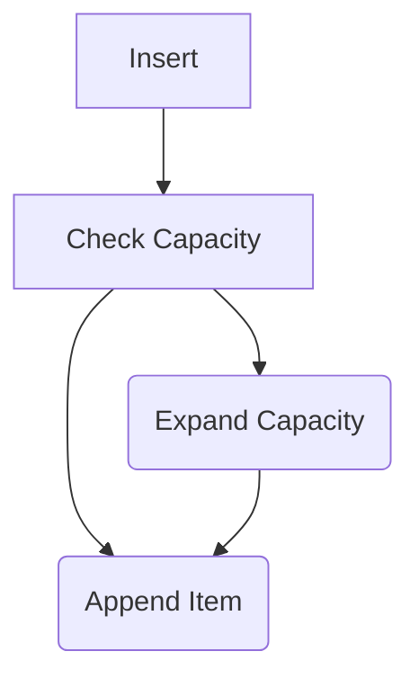
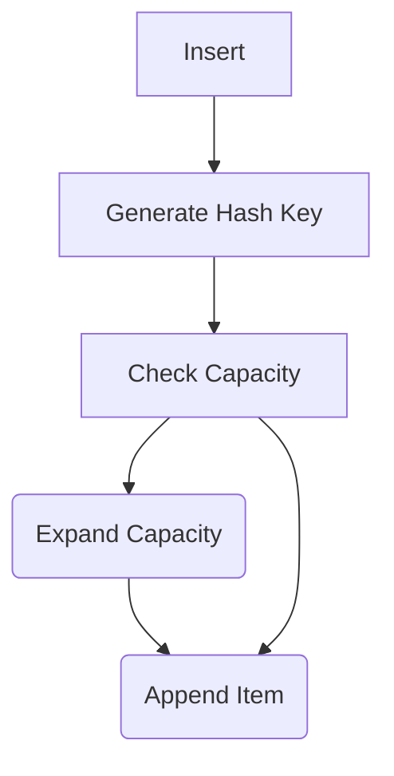

# HashMaps (aka Dictionaries or Maps)

> The code for this is in `auth_hashmap` and `login_hashmap`.

Vectors are great, but they order data exactly as is it was inserted. Using `find` requires that Rust read each record in turn, and check to see if its the record you were looking for. That's *really, really* fast---often faster than other techniques thanks to read-ahead cache in modern CPUs---but it can be difficult for quickly searching large data sets. Vectors also allow duplicate entries.

If you've used `Dictionary` types in other languages, this is the same thing.

First of all, `HashMap` isn't a type included in the default namespace. You have to use it. At the top of `lib.rs` in `authentication`, add:


```rust
use std::collections::HashMap;
```

For convenience later, let's decorate the `User` structure with `Clone` and `Debug`:

```rust
#[derive(Clone, Debug)]
pub struct User {
    pub username: String,
    pub password: String,
    pub action: LoginAction,
}
```

Now let's change `get_users` to create a HashMap. We'll use the username as the key:

```rust
pub fn get_users() -> HashMap<String, User> {
    let mut users = HashMap::new();
    users.insert("admin".to_string(), User::new("admin", "password", LoginRole::Admin));
    users.insert("bob".to_string(), User::new("bob", "password", LoginRole::User));
    users
}
```

We also need to change the `login` function. We can take advantage of `HashMap`'s fast search by using `get`:

```rust
pub fn login(username: &str, password: &str) -> Option<LoginAction> {
    let users = get_users();

    if let Some(user) = users.get(username) {
        if user.password == password {
            Some(LoginAction::Granted(user.role.clone()))
        } else {
            Some(LoginAction::Denied)
        }
    } else {
        None
    }
}
```

The rest of the program operates the same way. We can run it with `cargo run` and see that it works the same way as the vector version.

## HashMap versus Vector

`HashMap` is fast, but in a lot of cases it isn't as fast as a vector. When inserting into a vector, the following occurs:



Compare this with a `HashMap` insert:



That's a whole additional operation, and generating a hash can be a *slow* process---especially if you are using a cryptographically sound hashing algorithm.

Let's do a quick benchmark program to see the difference:

> This is available as `hash_vec_bench`.

```rust
use std::collections::HashMap;
const ELEMENTS: usize = 1_000_000;

fn main() {
    let mut my_vector = Vec::new();
    let now = std::time::Instant::now();
    for i in 0..ELEMENTS {
        my_vector.push(i);
    }
    let elapsed = now.elapsed();
    println!("Inserting {ELEMENTS} elements into a vector  took {} usecs", elapsed.as_micros());
    
    let mut my_hashmap = HashMap::new();
    let now = std::time::Instant::now();
    for i in 0..ELEMENTS {
        my_hashmap.insert(i, i);
    }
    let elapsed = now.elapsed();
    println!("Inserting {ELEMENTS} elements into a HashMap took {} usecs", elapsed.as_micros());
}
```

Running this in regular compile (debug), I get:

```
Inserting 1000000 elements into a vector  took 19066 usecs
Inserting 1000000 elements into a HashMap took 447122 usecs
```

Running in `release` mode with `cargo run --release` enables optimizations. This gets rid of some of the error-checking code, and makes the code run faster. I get:

```
Inserting 1000000 elements into a vector  took 5632 usecs
Inserting 1000000 elements into a HashMap took 68942 usecs
```

So you can see that inserting into a `HashMap` is a *lot* slower. But what about searching? Let's add a search to the benchmark:

> This is found in the `hash_vec_search` project.

```rust
use std::collections::HashMap;
const ELEMENTS: usize = 1_000_000;

fn main() {
    let mut my_vector = Vec::new();
    for i in 0..ELEMENTS {
        my_vector.push(i);
    }

    let mut my_hashmap = HashMap::new();
    for i in 0..ELEMENTS {
        my_hashmap.insert(i, i);
    }

    // Nearly the worst case
    let element_to_find = ELEMENTS - 2;

    let now = std::time::Instant::now();
    let result = my_vector.iter().find(|n| **n == element_to_find);
    println!("{result:?}");
    let elapsed = now.elapsed();
    println!("Vector search took {} usecs", elapsed.as_micros());
    
    let now = std::time::Instant::now();
    let result = my_hashmap.get(&element_to_find);
    println!("{result:?}");
    let elapsed = now.elapsed();
    println!("HashMap search took {} usecs", elapsed.as_micros());
}
```

Running in regular/debug mode:

```
Some(999998)
Vector search took 9413 usecs
Some(999998)
HashMap search took 110 usecs
```

In release mode (`cargo run --release`):

```
Some(999998)
Vector search took 1054 usecs
Some(999998)
HashMap search took 107 usecs
```

So `release` mode massively improves vector performance, and only slightly improves HashMap performance. But the HashMap is still *much* faster for searching.

**Takeaway**: Use `HashMap` when you are searching larger amounts of data, and `Vec` when searching isn't your primary task.