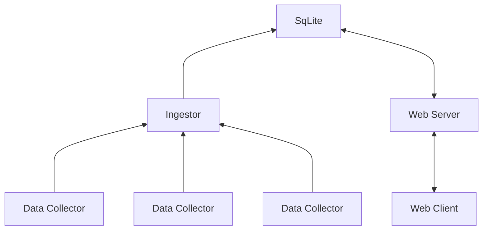

# Planning Our Project

> *No plan of operations extends with any certainty beyond the first encounter with the main enemy forces.* - Moltke

It's important to make a plan before you start on a project. It's also important to realize that your plan will change as you go along. The plan is not the goal, it's just a way to get started. As you learn more about the problem you're trying to solve, you'll find that your plan needs to change.

This is *version 1* of the plan, and it's designed to be small and achievable quickly. We'll build on it later.

## The Problem

Our company---Widget Corp---is building data-collection widgets for customers. These widgets are small, low-power devices that collect data from sensors and send it to a central server. The server stores the data, and provides a web interface for customers to view their data.

* We need to build a daemon to run on the data-collectors.
* We need to build a server to receive and store the data.
* We need to build a web service to query and display the data.

## The Data

WidgetCorp are collecting some really cool data, but we're going to collect some boring data to get started: CPU and memory usage. We'll also collect the time, so we can see how the data changes over time.

## Collection Daemon

The collection daemon has to run on small, low-power devices. I'm not going to ask you all to buy an embedded device, so we're going to pretend---and run on our local computers. However, we'll seek to minimize binary size, memory and CPU usage and keep network traffic to a minimum.

## Collection Server

The collection server will receive data from collection daemons, and store it in a database. We'll use sqlite for now.

## Web Service

We're going to start with a relatively minimal web-service that uses Apache E-Charts in the client to display the data. We'll use the Axum web framework, and we'll use the sqlite database directly.

## Overview

You can visualize the data-flow as follows:

