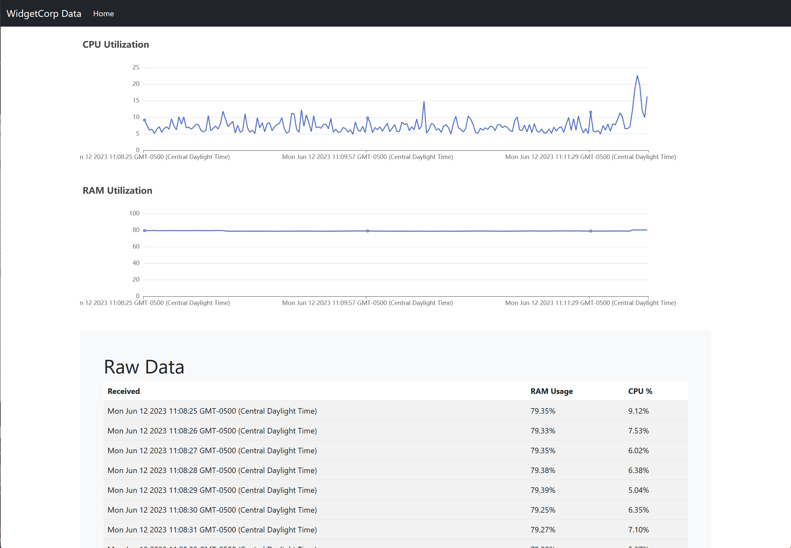

# Display Data in a Web Server

Now that you have a REST API for accessing collected data, it would be nice to display it.

Let's make a new module named `web.rs` and the associated `mod web;` in `main.rs`. We'll add a simple file reader:

```rust
use axum::response::Html;

pub async fn index() -> Html<String> {
    let path = std::path::Path::new("src/index.html");
    let content = tokio::fs::read_to_string(path).await.unwrap();
    Html(content)
}
```

We can add a route to `main.rs` as follows:

```rust
.route("/", get(web::index))
```

And remove the `test` function.

Now, we can add a simple HTML file to `src/index.html`:

```html
<!DOCTYPE html>
<html lang="en">

<head>
    <meta charset="UTF-8">
    <title>Server v2</title>
    <link href="https://cdn.jsdelivr.net/npm/bootstrap@5.3.0/dist/css/bootstrap.min.css" rel="stylesheet"
        integrity="sha384-9ndCyUaIbzAi2FUVXJi0CjmCapSmO7SnpJef0486qhLnuZ2cdeRhO02iuK6FUUVM" crossorigin="anonymous">
    <script src="https://code.jquery.com/jquery-3.7.0.min.js"
        integrity="sha256-2Pmvv0kuTBOenSvLm6bvfBSSHrUJ+3A7x6P5Ebd07/g=" crossorigin="anonymous"></script>
</head>

<body>
    <nav class="navbar navbar-expand-md navbar-dark bg-dark mb-4">
        <div class="container-fluid">
            <a class="navbar-brand" href="#">WidgetCorp Data</a>
            <button class="navbar-toggler" type="button" data-bs-toggle="collapse" data-bs-target="#navbarCollapse"
                aria-controls="navbarCollapse" aria-expanded="false" aria-label="Toggle navigation">
                <span class="navbar-toggler-icon"></span>
            </button>
            <div class="collapse navbar-collapse" id="navbarCollapse">
                <ul class="navbar-nav me-auto mb-2 mb-md-0">
                    <li class="nav-item">
                        <a class="nav-link active" aria-current="page" href="#">Home</a>
                    </li>
                </ul>
            </div>
        </div>
    </nav>

    <main class="container">
        <div class="bg-body-tertiary p-5 rounded">
            <h1>All Collectors</h1>
            <div id="collectors">
            </div>
    </main>

    <script>
        function loadCollectors() {
            $.ajax({
                url: "http://localhost:3000/api/collectors",
                type: "GET",
                dataType: "json",
                success: function (data) {
                    let html = "<table class='table table-striped'>";
                    html += "<thead><tr><th>Collector ID</th><th>Last Seen</th></tr></thead>";
                    html += "<tbody>";
                    for (let i = 0; i < data.length; i++) {
                        html += "<tr>";
                        let link = "/collector.html?id=" + data[i].collector_id;
                        html += "<td><a href='" + link + "'>" + data[i].collector_id + "</a></td>";
                        var date = new Date(data[i].last_seen * 1000);
                        html += "<td>" + date + "</td>";
                        html += "</tr>";
                    }
                    html += "</tbody>";
                    html += "</table>";
                    $("#collectors").html(html);
                },
                error: function (jqXHR, textStatus, errorThrown) {
                    console.log(textStatus, errorThrown);
                }
            });
        }

        $(document).ready(function () {
            loadCollectors();
        });
    </script>
</body>

</html>
```

I've used JQuery and Bootstrap to make something vaguely pretty. I recommend cutting and pasting---this isn't an HTML/JavaScript class, so we're just going to skim over the details a bit.

### Displaying Collector Data

Now that we have an index page listing all of the collectors, we need to implement `collector.html` as well.

Let's add another function to `web.rs`:

```rust
pub async fn collector() -> Html<String> {
    let path = std::path::Path::new("src/collector.html");
    let content = tokio::fs::read_to_string(path).await.unwrap();
    Html(content)
}
```

And a route to it:

```rust
let app = Router::new()
    .route("/", get(web::index))
    .route("/collector.html", get(web::collector))
```

And of course, write the HTML:

```html
<!DOCTYPE html>
<html lang="en">

<head>
    <meta charset="UTF-8">
    <title>Server v2</title>
    <link href="https://cdn.jsdelivr.net/npm/bootstrap@5.3.0/dist/css/bootstrap.min.css" rel="stylesheet"
        integrity="sha384-9ndCyUaIbzAi2FUVXJi0CjmCapSmO7SnpJef0486qhLnuZ2cdeRhO02iuK6FUUVM" crossorigin="anonymous">
    <script src="https://code.jquery.com/jquery-3.7.0.min.js"
        integrity="sha256-2Pmvv0kuTBOenSvLm6bvfBSSHrUJ+3A7x6P5Ebd07/g=" crossorigin="anonymous"></script>
</head>

<body>
    <nav class="navbar navbar-expand-md navbar-dark bg-dark mb-4">
        <div class="container-fluid">
            <a class="navbar-brand" href="#">WidgetCorp Data</a>
            <button class="navbar-toggler" type="button" data-bs-toggle="collapse" data-bs-target="#navbarCollapse"
                aria-controls="navbarCollapse" aria-expanded="false" aria-label="Toggle navigation">
                <span class="navbar-toggler-icon"></span>
            </button>
            <div class="collapse navbar-collapse" id="navbarCollapse">
                <ul class="navbar-nav me-auto mb-2 mb-md-0">
                    <li class="nav-item">
                        <a class="nav-link active" aria-current="page" href="#">Home</a>
                    </li>
                </ul>
            </div>
        </div>
    </nav>

    <main class="container">
        <div class="bg-body-tertiary p-5 rounded">
            <h1>Raw Data</h1>
            <div id="rawData">
                Loading, Please Wait...
            </div>
    </main>

    <script>
        function loadCollector() {
            const urlParams = new URLSearchParams(window.location.search);
            const id = urlParams.get('id');

            $.get("/api/collector/" + id, (data) => {
                console.log(data);
                let html = "<table class='table table-striped'>";
                html += "<thead><tr><th>Received</th><th>RAM Usage</th><th>CPU %</th></tr></thead>";
                html += "<tbody>";
                for (let i = 0; i < data.length; i++) {
                    let row = data[i];
                    var date = new Date(row.received * 1000);
                    html += "<td>" + date + "</td>";
                    html += "<td>" + ((row.used_memory / row.total_memory) * 100.0).toFixed(2) + "%</td>";
                    html += "<td>" + row.average_cpu.toFixed(2) + "%</td>";
                    html += "<tr>";
                    html += "</tr>";
                }
                html += "</tbody>";
                html += "</table>";
                $("#rawData").html(html);
            })
        }

        $(document).ready(function () {
            loadCollector();
        });
    </script>
</body>

</html>
```

## Let's Make It Pretty

We add a CDN link to echarts:

```html
<script src="https://cdnjs.cloudflare.com/ajax/libs/echarts/5.4.2/echarts.min.js" integrity="sha512-VdqgeoWrVJcsDXFlQEKqE5MyhaIgB9yXUVaiUa8DR2J4Lr1uWcFm+ZH/YnzV5WqgKf4GPyHQ64vVLgzqGIchyw==" crossorigin="anonymous" referrerpolicy="no-referrer"></script>
```

Then we add some DIVs for the graphs:

```html
<main class="container">
    <div style="width: 100%; height: 300px" id="cpuGraph"></div>
    <div style="width: 100%; height: 300px" id="ramGraph"></div>
```

And we add some JavaScript to draw the graphs:

```javascript
function loadCollector(cpuChart, ramChart) {
    const urlParams = new URLSearchParams(window.location.search);
    const id = urlParams.get('id');

    $.get("/api/collector/" + id, (data) => {
        let x = [];
        let cpu = [];
        let ram = [];

        console.log(data);
        let html = "<table class='table table-striped'>";
        html += "<thead><tr><th>Received</th><th>RAM Usage</th><th>CPU %</th></tr></thead>";
        html += "<tbody>";
        for (let i = 0; i < data.length; i++) {
            let row = data[i];
            var date = new Date(row.received * 1000);
            html += "<td>" + date + "</td>";
            html += "<td>" + ((row.used_memory / row.total_memory) * 100.0).toFixed(2) + "%</td>";
            html += "<td>" + row.average_cpu.toFixed(2) + "%</td>";
            html += "<tr>";
            html += "</tr>";

            x.push(date);
            cpu.push(row.average_cpu);
            ram.push((row.used_memory / row.total_memory) * 100.0);
        }
        html += "</tbody>";
        html += "</table>";
        $("#rawData").html(html);

        var option = {
            title: {
                text: 'CPU Utilization'
            },
            xAxis: {
                type: 'category',
                data: x
            },
            yAxis: {
                type: 'value'
            },
            series: [{
                data: cpu,
                type: 'line'
            }]
        };
        option && cpuChart.setOption(option);

        option = {
            title: {
                text: 'RAM Utilization'
            },
            xAxis: {
                type: 'category',
                data: x
            },
            yAxis: {
                type: 'value'
            },
            series: [{
                data: ram,
                type: 'line'
            }]
        };
        option && ramChart.setOption(option);

        cpuChart.hideLoading();
        ramChart.hideLoading();
    })
}

$(document).ready(function () {
    var cpuChart = echarts.init(document.getElementById('cpuGraph'));
    var ramChart = echarts.init(document.getElementById('ramGraph'));
    cpuChart.showLoading();
    ramChart.showLoading();
    loadCollector(cpuChart, ramChart);
});
```

And voila---we have a decent looking data collector:



Many projects would say "good enough, ship it!"... (hopefully after adding some authentication, anyway)